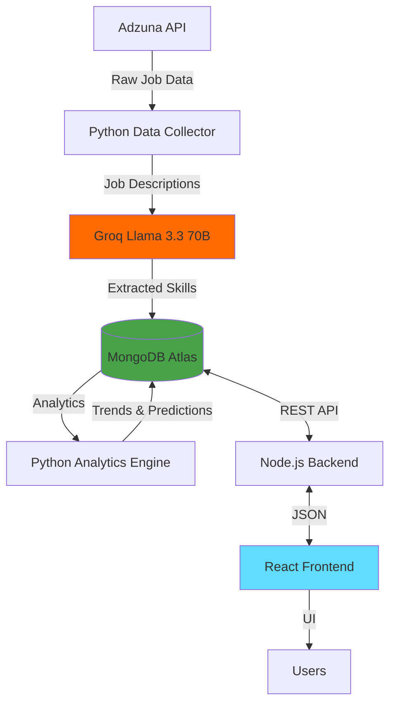

<div align="center">

# 🎯 SkillPulse

### Personalized AI Career Navigator

*From Market Trends to Your Learning Roadmap*

[](https://www.mongodb.com/)
[](https://reactjs.org/)
[](https://nodejs.org/)
[](https://www.python.org/)
[](https://groq.com/)

**Current Status:** 🚧 In Development | Week 2 of 12

</div>

---

## 📖 About The Project

**SkillPulse** is an AI-powered career intelligence platform that helps students and professionals make data-driven career decisions by analyzing real-time job market trends.

### 💡 The Problem

- 🤔 Students waste months learning outdated technologies
- 📊 No real-time visibility into skill demand trends
- 🎯 Job descriptions use vague terms without clarity
- 📚 Courses teach yesterday's tech by the time you finish

### ✨ The Solution

**Real-time skill trend analysis** → **Personalized gap identification** → **Data-driven learning paths**

> Analyze 3,000+ job postings monthly using AI to extract skills, track trends, and generate personalized career roadmaps.

---

## 🚀 Features (7 Core Features)

<table>
<tr>
<td width="50%">

### 📊 Public Trend Dashboard
- Top 20 in-demand skills
- Trending ↑ and declining ↓ skills
- Weekly trend charts
- Filter by role/domain

</td>
<td width="50%">

### 🎯 Skill Gap Analysis
- Match % against target role
- Prioritized missing skills
- Impact estimation
- Learning recommendations

</td>
</tr>
<tr>
<td width="50%">

### 📚 Learning Path Generator
- Step-by-step roadmap
- Free curated resources
- Realistic timelines
- Progress tracking

</td>
<td width="50%">

### 📈 Trend Predictions
- ML-powered forecasts (Linear Regression)
- Emerging role detection
- Market intelligence
- Interactive visualizations

</td>
</tr>
</table>

---

## 🛠️ Tech Stack

### Frontend (Coming in Week 7)


### Backend ✅ (Working)


### AI & Analytics ✅ (Working)


### Data Sources ✅ (Working)
- **Adzuna API** - India tech jobs (primary)
- **Remotive API** - Remote jobs (planned)
- **GitHub Jobs API** - Developer roles (planned)
- **JSearch API** - Aggregated data (planned)
- **Reddit API** - r/IndiaJobs (planned)

---

## 🏗️ System Architecture



---

## 📊 Current Progress (Week 2)

### ✅ Completed (Days 1-3)

**Day 1: Environment Setup**
- ✅ Development environment configured
- ✅ MongoDB Atlas cluster created
- ✅ GitHub repository initialized
- ✅ Project structure established

**Day 2: API Integration**
- ✅ Adzuna API integrated (5,000 calls/month free)
- ✅ Job data collection pipeline working
- ✅ MongoDB storage implemented
- ✅ 130+ jobs collected

**Day 3: AI Skill Extraction**
- ✅ Groq Llama 3.3 70B integrated (14,400 requests/day)
- ✅ 83.8% skill extraction accuracy achieved
- ✅ 141 unique skills identified
- ✅ HTML cleaning & data validation
- ✅ Real-time skill demand analysis working

**Current Database Stats:**
```
Total Jobs: 130
Jobs with Skills: 109 (83.8%)
Unique Skills Tracked: 141
Average Skills per Job: 7.3
```

**Top 5 In-Demand Skills (Current Data):**
1. JavaScript - 28.4%
2. PHP - 27.5%
3. React - 23.9%
4. Flutter - 22.9%
5. MongoDB - 22.0%

### 🔄 In Progress (Week 3-4)

**Day 4-5: Data Pipeline Enhancement**
- ⏳ Skill normalization (React.js → React)
- ⏳ Trend calculation engine
- ⏳ Multiple API source integration
- ⏳ Weekly data collection automation

---

## 🚀 Getting Started

### Prerequisites

- **Node.js** v18+ ([Download](https://nodejs.org/))
- **Python** 3.11+ ([Download](https://www.python.org/))
- **MongoDB Atlas** account ([Sign up](https://www.mongodb.com/cloud/atlas/register))
- **Groq API Key** ([Get Free Key](https://console.groq.com/keys))

### Installation

**1. Clone the repository**
```bash
git clone https://github.com/Suraj-Wakchaure/skillpulse.git
cd skillpulse
```

**2. Setup Backend**
```bash
cd backend
npm install
cp .env.example .env  # Add your MongoDB URI
npm run dev
```

**3. Setup Python Service**
```bash
cd python-service
python -m venv venv

# Windows
venv\Scripts\activate

# Mac/Linux
source venv/bin/activate

pip install -r requirements.txt
cp .env.example .env  # Add your API keys
python app.py
```

**4. Setup Frontend** *(Coming in Week 7)*
```bash
cd frontend
npm install
npm start
```

### Environment Variables

**Backend (`.env`):**
```env
MONGODB_URI=your_mongodb_connection_string
PORT=5000
JWT_SECRET=your_jwt_secret
ADZUNA_APP_ID=your_adzuna_app_id
ADZUNA_APP_KEY=your_adzuna_app_key
```

**Python Service (`.env`):**
```env
MONGODB_URI=your_mongodb_connection_string
FLASK_PORT=5001
GROQ_API_KEY=your_groq_api_key
ADZUNA_APP_ID=your_adzuna_app_id
ADZUNA_APP_KEY=your_adzuna_app_key
```

---

## 📁 Project Structure

```
skillpulse/
├── 📱 frontend/              # React application (Week 7)
├── 🔧 backend/               # Node.js API server
│   ├── controllers/         # Business logic
│   ├── models/              # Database schemas
│   ├── routes/              # API routes
│   ├── middleware/          # Auth, validation
│   └── server.js            ✅ Working
├── 🐍 python-service/        # Python analytics ✅ Working
│   ├── src/
│   │   ├── collectors/      # Job data collection ✅
│   │   ├── ai/              # Skill extraction (Groq) ✅
│   │   ├── analytics/       # Trend calculation (In Progress)
│   │   └── database.py      ✅ MongoDB connection
│   └── app.py               ✅ Flask server
└── 📜 scripts/               # Automation scripts
```

---

## 📊 Data Pipeline

### Current Workflow

```
1. Adzuna API (Weekly)
   ↓
2. Python Collector (Filter India + Tech)
   ↓
3. Groq Llama 3.3 (Extract Skills)
   ↓
4. MongoDB (Store Jobs + Skills)
   ↓
5. Analytics Engine (Calculate Trends)
   ↓
6. REST API (Serve to Frontend)
```

### Data Quality Metrics

| Metric | Current | Target | Status |
|--------|---------|--------|--------|
| Extraction Accuracy | 83.8% | 90%+ | ✅ Good |
| Jobs Processed | 130 | 3,000/month | 🔄 Scaling |
| Unique Skills | 141 | 200+ | ✅ Good |
| API Quota | 14,400/day | Sufficient | ✅ Excellent |

---

## 🎯 Unique Value Proposition

**What makes SkillPulse different from LinkedIn/Stack Overflow Survey:**

| Feature | LinkedIn/Others | SkillPulse |
|---------|-----------------|------------|
| **Cost** | Paid reports ($500+) | 100% Free |
| **Personalization** | Generic trends | YOUR skill gap |
| **Action Plan** | Just data | Learning roadmap |
| **Update Frequency** | Quarterly/Yearly | Weekly |
| **Geographic Focus** | Global | India tech hubs |
| **Emerging Skills** | Delayed detection | Real-time (8-12 week advantage) |
| **Progress Tracking** | One-time report | Continuous tracking |

---

## 🗓️ Development Timeline (12 Weeks)

**Current Status: Week 2**

```
✅ Week 1-2: Planning & Setup
├─ ✅ Day 1: Environment Setup
├─ ✅ Day 2: API Integration
└─ ✅ Day 3: AI Skill Extraction

🔄 Week 3-4: Data Collection Pipeline
├─ ⏳ Day 4: Skill Normalization
├─ ⏳ Day 5: Trend Calculation
└─ ⏳ Automation with GitHub Actions

⏳ Week 5-6: Backend Development
├─ Authentication (JWT)
├─ User Management APIs
└─ Trend Calculation APIs

⏳ Week 7-9: Frontend Development
├─ Dashboard UI
├─ Skill Gap Analysis
└─ Learning Path Generator

⏳ Week 10: Testing & QA

⏳ Week 11-12: Deployment & Documentation
```

---

## 🧪 Testing

### Run Data Collection
```bash
cd python-service
python src/collectors/adzuna_collector.py
```

### View Skill Statistics
```bash
python src/view_skills.py
```

### Update Jobs Without Skills
```bash
python src/update_missing_skills.py
```

---

## 📈 Roadmap

### Immediate (Week 3-4)
- [ ] Implement skill normalization engine
- [ ] Add weekly trend calculation
- [ ] Integrate 4 additional API sources
- [ ] Setup GitHub Actions automation

### Short-term (Week 5-9)
- [ ] Complete backend authentication
- [ ] Build REST APIs for all features
- [ ] Develop React frontend
- [ ] Implement Chart.js visualizations

### Long-term (Week 10-12)
- [ ] ML-based trend predictions
- [ ] User testing with 10-15 students
- [ ] Production deployment
- [ ] Complete project documentation

---

## 🤝 Contributing

This is an academic project (BCA Final Year), but suggestions are welcome!

---

## 📝 License

This project is part of BCA Final Year curriculum at Pimpri Chinchwad University.  
For academic use only.

---

## 👨‍💻 Author

**Suraj Wakchaure**

- 🎓 BCA Final Year, Pimpri Chinchwad University
- 📧 Email: [suraj.wakchaure04@gmail.com]
- 💼 LinkedIn: [www.linkedin.com/in/suraj-wakchaure]
- 🐙 GitHub: [(https://github.com/Suraj-Wakchaure)]

**Project Guide:** Prof. Madhuri Dharrao  
**Project Coordinator:** Mr. Aditya Katkar

---

## 🙏 Acknowledgments

- **Pimpri Chinchwad University** - Academic support
- **Groq** - AI infrastructure (Llama 3.3 70B)
- **MongoDB Atlas** - Database infrastructure
- **Adzuna** - Job market data API
- **Open Source Community** - Libraries and tools

---

## 📞 Contact & Support

- 📧 **Email:** [suraj.wakchaure04@gmail.com]
- 💬 **Issues:** [GitHub Issues](https://github.com/Suraj-Wakchaure/skillpulse/issues)

---

<div align="center">

### ⭐ Star this repo if you find it helpful!

**Made with ❤️ for students, by a student**

*SkillPulse • January 2026 - April 2026*

**Current Sprint:** Week 2 | AI Skill Extraction ✅ Complete

</div>