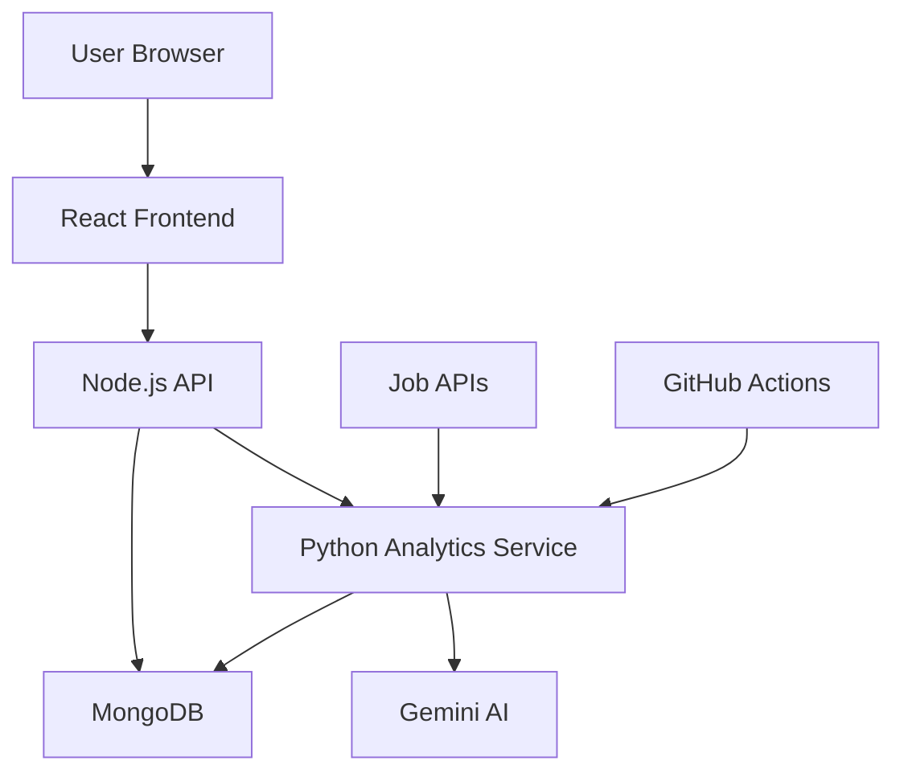

<div align="center">

# 🎯 SkillPulse

### AI-Powered Career Intelligence Platform

*Transforming job market data into actionable career insights*

[](https://www.mongodb.com/)
[](https://reactjs.org/)
[](https://nodejs.org/)
[](https://www.python.org/)
[](https://flask.palletsprojects.com/)

[Features](#-features) • [Demo](#-demo) • [Tech Stack](#-tech-stack) • [Getting Started](#-getting-started) • [Roadmap](#-roadmap)

</div>

---

## 📖 About The Project

**SkillPulse** analyzes 2500+ job postings monthly using AI to help students and professionals make data-driven career decisions. Stop guessing what to learn—know exactly which skills are in demand.

### 💡 The Problem

- 🤔 Students waste months learning outdated technologies
- 📊 No real-time visibility into skill demand trends
- 🎯 Job descriptions use vague terms without clarity
- 📚 Courses teach yesterday's tech by the time you finish

### ✨ The Solution

> **Real-time skill trend analysis** → **Personalized gap identification** → **Data-driven learning paths**

---

## 🚀 Features

<table>
<tr>
<td width="50%">

### 📊 Public Trend Dashboard
- Top 20 in-demand skills
- Trending ↑ and declining ↓ skills
- Weekly trend charts
- Filter by role/domain

</td>
<td width="50%">

### 🎯 Skill Gap Analysis
- Match % against target role
- Prioritized missing skills
- Impact estimation
- Learning recommendations

</td>
</tr>
<tr>
<td width="50%">

### 📚 Learning Path Generator
- Step-by-step roadmap
- Free curated resources
- Realistic timelines
- Progress tracking

</td>
<td width="50%">

### 📈 Trend Predictions
- ML-powered forecasts
- Emerging role detection
- Market intelligence
- Interactive visualizations

</td>
</tr>
</table>

---

## 🎬 Demo

> 🚧 **Coming Soon** - Live demo will be available by February 2026

**Expected Features:**
- ✅ Browse trends without signup
- ✅ Create profile and add skills
- ✅ Get personalized skill gap report
- ✅ Generate custom learning roadmap
- ✅ Track progress over time

---

## 🛠️ Tech Stack

### Frontend


### Backend


### AI & Analytics


### Deployment


---

## 🏗️ Architecture


---

## 📁 Project Structure
```
skillpulse/
├── 📱 frontend/              # React application
│   ├── src/
│   │   ├── components/      # Reusable UI components
│   │   ├── pages/           # Page components
│   │   ├── services/        # API calls
│   │   └── utils/           # Helper functions
│   └── public/
├── 🔧 backend/               # Node.js API server
│   ├── controllers/         # Business logic
│   ├── models/              # Database schemas
│   ├── routes/              # API routes
│   ├── middleware/          # Auth, validation
│   └── server.js
├── 🐍 python-service/        # Python analytics
│   ├── src/
│   │   ├── collectors/      # Job data collection
│   │   ├── ai/              # Skill extraction
│   │   └── analytics/       # Trend calculation
│   └── app.py
└── 📜 scripts/               # Automation scripts
```

---

## 🚀 Getting Started

### Prerequisites

- **Node.js** v18+ ([Download](https://nodejs.org/))
- **Python** 3.10+ ([Download](https://www.python.org/))
- **MongoDB Atlas** account ([Sign up](https://www.mongodb.com/cloud/atlas/register))
- **Git** ([Download](https://git-scm.com/))

### Installation

1️⃣ **Clone the repository**
```bash
git clone https://github.com/Suraj-Wakchaure/skillpulse.git
cd skillpulse
```

2️⃣ **Setup Backend**
```bash
cd backend
npm install
cp .env.example .env  # Add your MongoDB URI
npm run dev
```

3️⃣ **Setup Python Service**
```bash
cd python-service
python -m venv venv
venv\Scripts\activate      # Windows
source venv/bin/activate   # Mac/Linux
pip install -r requirements.txt
cp .env.example .env       # Add your API keys
python app.py
```

4️⃣ **Setup Frontend** *(Coming in Day 2)*
```bash
cd frontend
npm install
npm start
```

### Environment Variables

**Backend (`.env`):**
```env
MONGODB_URI=your_mongodb_connection_string
PORT=5000
JWT_SECRET=your_jwt_secret
```

**Python Service (`.env`):**
```env
MONGODB_URI=your_mongodb_connection_string
FLASK_PORT=5001
GEMINI_API_KEY=your_gemini_api_key
```

---

## 📊 Data Sources

We use **legal APIs** (no web scraping) to collect job data:

| Source | Coverage | Status |
|--------|----------|--------|
| 🔵 Adzuna API | India tech jobs | ✅ Active |
| 🟢 Remotive API | Remote jobs | ✅ Active |
| 🟣 GitHub Jobs | Developer roles | ✅ Active |
| 🔴 JSearch (RapidAPI) | Aggregated data | ✅ Active |
| 🟠 Reddit r/IndiaJobs | Community posts | ✅ Active |

**Total:** ~3,000 jobs analyzed monthly

---

## 🗓️ Roadmap

### Phase 1: Foundation ✅ (Week 1-2)
- [x] Project setup
- [x] MongoDB configuration
- [x] Basic server structure

### Phase 2: Data Pipeline 🔄 (Week 3-4)
- [ ] API integrations
- [ ] AI skill extraction
- [ ] Automated collection

### Phase 3: Backend (Week 5-6)
- [ ] Authentication system
- [ ] Trend calculation
- [ ] ML predictions

### Phase 4: Frontend (Week 7-9)
- [ ] Dashboard UI
- [ ] Skill gap analysis page
- [ ] Learning path generator

### Phase 5: Deployment (Week 10-12)
- [ ] Production deployment
- [ ] Testing & optimization
- [ ] Final documentation

---

## 🤝 Contributing

This is an academic project, but suggestions are welcome!

1. Fork the repository
2. Create feature branch (`git checkout -b feature/AmazingFeature`)
3. Commit changes (`git commit -m 'Add AmazingFeature'`)
4. Push to branch (`git push origin feature/AmazingFeature`)
5. Open a Pull Request

---

## 📝 License

This project is part of BCA Final Year curriculum at Pimpri Chinchwad University.

For academic use only. Not licensed for commercial use.

---

## 👨‍💻 Author

**[Suraj Wakchaure]**

- 🎓 BCA Final Year, Pimpri Chinchwad University
- 📧 Email: [suraj.wakchaure04@gmail.com](mailto:suraj.wakchaure04@gmail.com)
- 💼 LinkedIn: [Suraj-Wakchaure](https://linkedin.com/in/suraj-wakchaure)
- 🐙 GitHub: [Suraj-Wakchaure](https://github.com/Suraj-Wakchaure)

**Project Guide:** Mrs. Madhuri Dharrao
**Project Coordinator:** Mr. Aditya Katkar

---

## 🙏 Acknowledgments

- **Pimpri Chinchwad University** - Academic support
- **Gemini API** - AI capabilities
- **MongoDB Atlas** - Database infrastructure
- **Open Source Community** - Libraries and tools

---

## 📞 Contact & Support

- 📧 **Email:** [suraj.wakchaure04@gmail.com](mailto:suraj.wakchaure04@gmail.com)
- 💬 **Issues:** [GitHub Issues](https://github.com/Suraj-Wakchaure/skillpulse/issues)
- 📚 **Documentation:** [Wiki](https://github.com/Suraj-Wakchaure/skillpulse/wiki)

---

<div align="center">

### ⭐ Star this repo if you find it helpful!

**Made with ❤️ for students, by a student**

*SkillPulse • January 2026 - April 2026*

[](https://github.com/Suraj-Wakchaure/skillpulse/stargazers)
[](https://github.com/Suraj-Wakchaure/skillpulse/network/members)

</div>