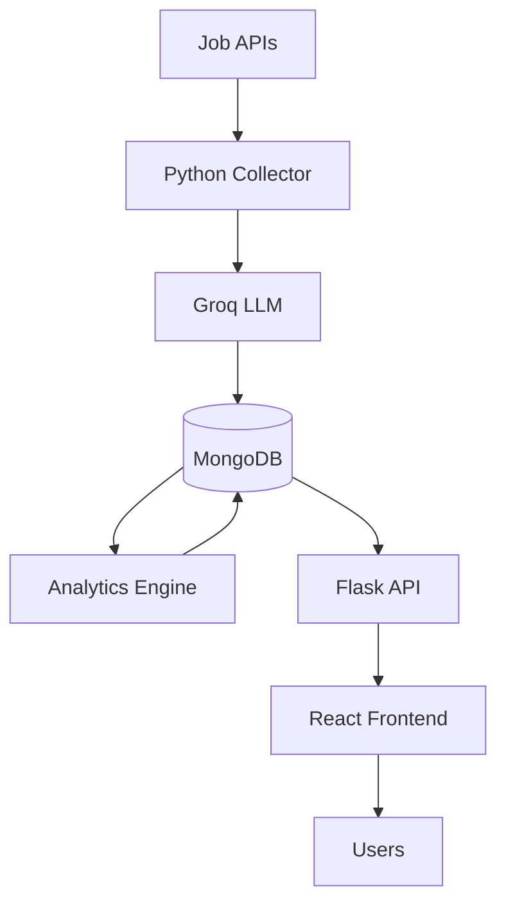

<div align="center">

# 🎯 SkillPulse

### Personalized AI Career Navigator

*From Market Trends to Your Learning Roadmap*


**Current Status:** ✅ Production Ready | Deployment Complete (April 2026)

[🌐 Live Application](https://skillpulse-api-2026.onrender.com)
[🔧 Backend API](https://skillpulse-api-2026.onrender.com/api/stats)

</div>

---

## 📖 About The Project

**SkillPulse** is an AI-powered career intelligence platform developed as a BCA Final Year project. It helps students make data-driven career decisions by analyzing real-time tech job market trends in India.

### 💡 The Problem

* 📉 Curriculum often lags behind industry
* 📊 No clear visibility of in-demand skills
* 🎯 Hard to create focused learning paths

### ✨ The Solution

SkillPulse automates career research by:

* Scraping job postings
* Using AI (LLMs) to extract skills
* Generating personalized learning roadmaps

---

## 🏗️ System Architecture



---

## 🚀 Core Features

* 📊 **Real-Time Analytics** – Top skills & trends
* 🎯 **Skill Gap Analysis** – Match % against jobs
* 📚 **AI Roadmap Generator** – Personalized learning path
* 📈 **Trend Prediction** – Future skill demand
* ⚙️ **Automated Pipeline** – Weekly updates

---

## 🛠️ Tech Stack

### Frontend

* React 18
* Tailwind CSS
* Chart.js

### Backend

* Python Flask
* Gunicorn
* Groq LLM
* Scikit-learn

### Infrastructure

* MongoDB Atlas
* GitHub Actions
* JWT Auth

---

## 📁 Project Structure

```
skillpulse/
├── frontend/
├── python-service/
│   ├── src/
│   │   ├── collectors/
│   │   ├── ai/
│   │   └── analytics/
│   └── app.py
└── .github/
```

---

## 🚀 Getting Started

### 1. Clone Repo

```bash
git clone https://github.com/Suraj-Wakchaure/skillpulse.git
```

### 2. Backend

```bash
cd python-service
pip install -r requirements.txt
python app.py
```

### 3. Frontend

```bash
cd frontend
npm install
npm start
```

---

## 👨‍💻 Author

**Suraj Wakchaure**
🎓 BCA Final Year – Pimpri Chinchwad University

* GitHub: https://github.com/Suraj-Wakchaure
* LinkedIn: https://www.linkedin.com/in/suraj-wakchaure

---

<div align="center">

⭐ Final Year BCA Project
SkillPulse • 2026

</div>
